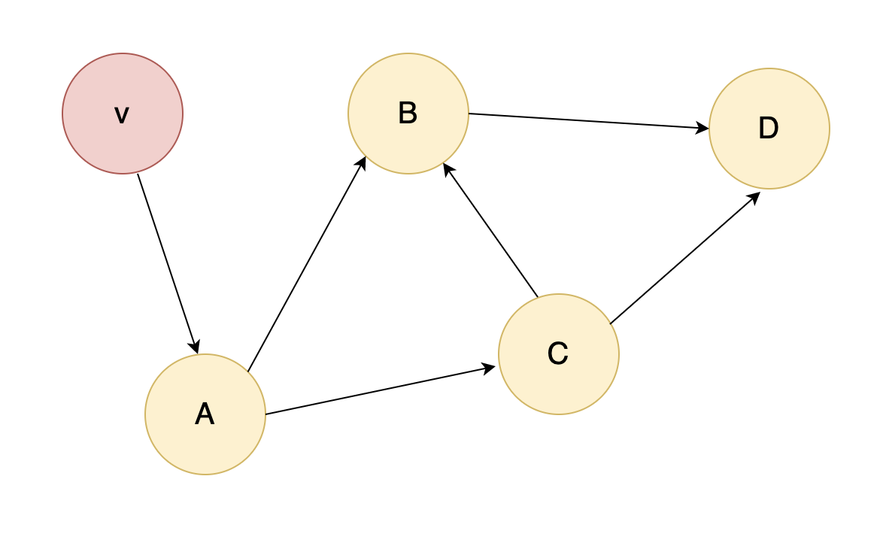
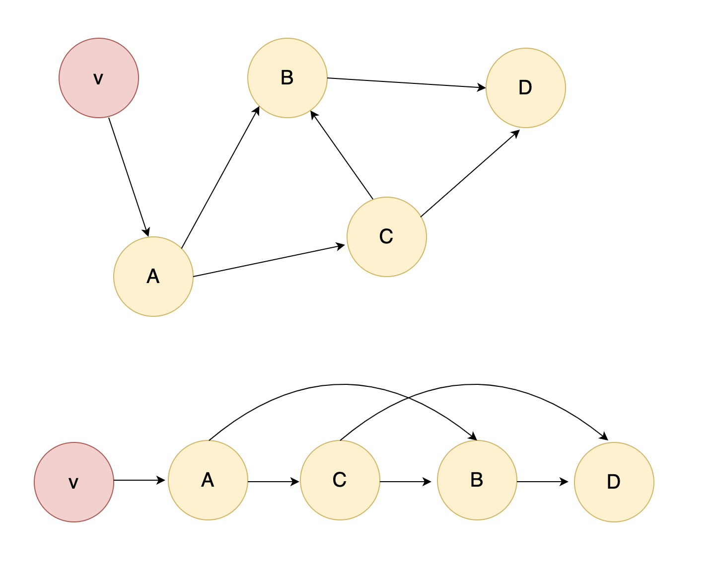

<!-- sectionTitle: どのように依存グラフを作るのか? -->

## どのように依存グラフを作るのか?

---

<!-- block-start: grid -->

<!-- block-start: column -->



<!-- block-end -->

<!-- block-start: column -->

### 有向非巡回グラフ (DAG)

<br />

エントリーポイントからのすべてのモジュールの依存を知るには、閉路がない有向グラフ(つまり一方通行で自身に戻らない)である DAG を利用する。

<br />

そして[半順序](https://ja.wikipedia.org/wiki/%E9%A0%86%E5%BA%8F%E9%9B%86%E5%90%88)関係とみなす
DAG で必ず成り立つ[トポロジカルソート](https://ja.wikipedia.org/wiki/%E3%83%88%E3%83%9D%E3%83%AD%E3%82%B8%E3%82%AB%E3%83%AB%E3%82%BD%E3%83%BC%E3%83%88)を使い、
依存関係を構成する。

<!-- block-end -->

<!-- block-end -->

---

<!-- block-start: grid -->

<!-- block-start: column -->



<!-- block-end -->

<!-- block-start: column -->

### トポロジカルソート

<br />

𝑂(|𝑉|+|𝐸|)

<br />

すべてのノード v1, v2 に対して、到達可能経路がある場合に必ず v1 を v2 の前に持ってくるアルゴリズムであり、
この DAG の半順序を拡張し、全順序を得る。

<br />

主な実現方法として、深さ優先探索(DFS)と幅優先探索(BFS)のどちらかがあり、どちらも計算量は同じとなる。

<br />

[webpack での実装例](https://github.com/webpack/webpack/blob/06ae0b381ddb08fac9745667a2d8f3c399473834/lib/MultiCompiler.js#L194)

<!-- block-end -->

<!-- block-end -->

---

<!-- block-start: grid -->

<!-- block-start: column -->


<!-- block-end -->

<!-- block-start: column -->

<!-- executable-code -->

```javascript
const vertices = new Map(); // key: name, value: deps
const visited = new Set();
const res = [];

vertices.set('v', ['a']); //      v -> a
vertices.set('a', ['b', 'c']); // a -> b, a -> c
vertices.set('b', ['d']); //      b -> d
vertices.set('c', ['b', 'd']); // c -> d, c -> d
vertices.set('d', []); //         d

for (const [name] of vertices) {
  dfs(name);
}
console.log(res.reverse()); // [ 'v', 'a', 'c', 'b', 'd' ]

function dfs(name, stack = new Set()) {
  if (visited.has(name)) return;
  visited.add(name);
  stack.add(name);
  const edges = vertices.get(name);

  for (const edge of edges) {
    // 再帰スタックにすでに頂点が入っている場合、閉路グラフである
    if (stack.has(edge)) return;
    dfs(edge, stack);
  }
  stack.delete(name);
  res.push(name);
}
```

<!-- block-end -->

<!-- block-end -->
