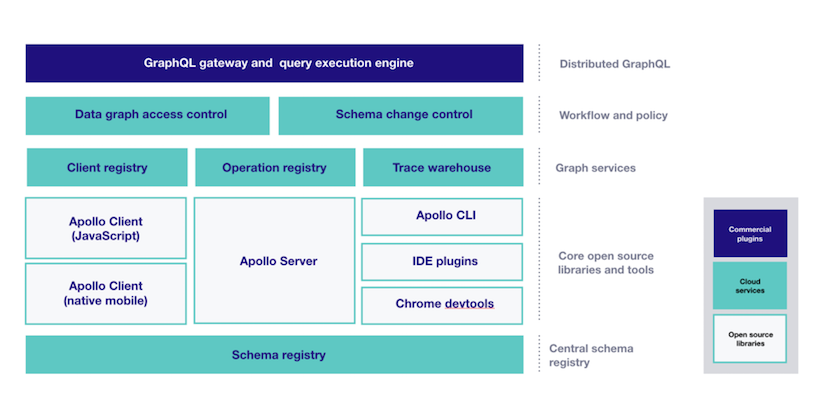
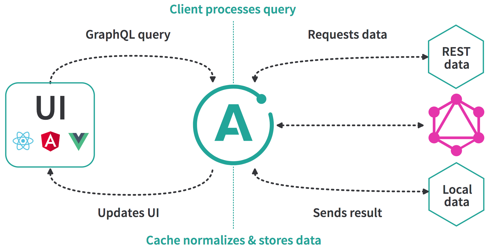
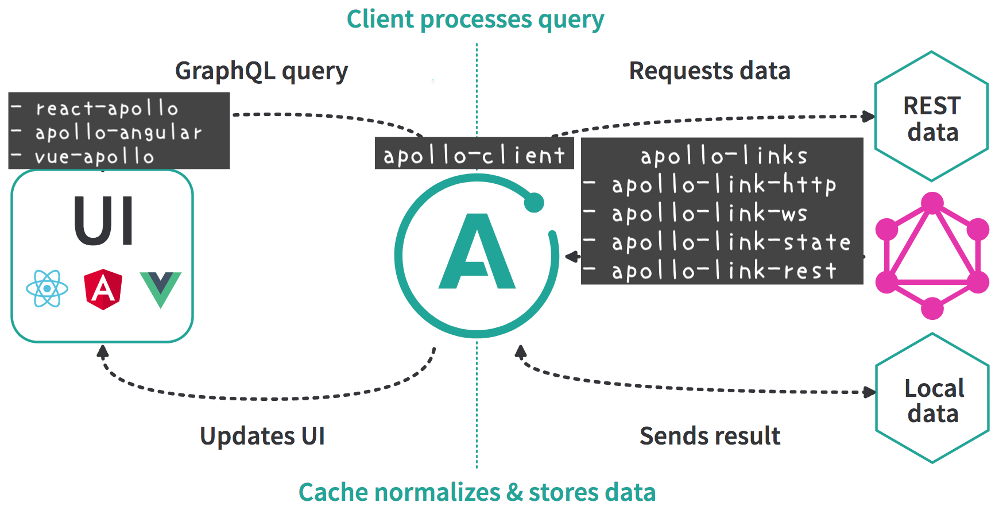

<!-- sectionTitle: Apollo -->

## Apollo

 

 

https://www.apollographql.com/

---

<!-- note
Apolloはopen source componentsとcommercial extensionsとcloud servicesを提供します。
プランはCommunityとTeamとEnterpriseの三種類があり、Data graph platformを使いたい場合は、契約が必要です。

-->

<a href="https://www.apollographql.com/docs/intro/platform.html" class="ref-link">The Apollo GraphQL platform</a>

---

<!-- note
apolloはjavascriptだけではなく、iOSやAndroidでも利用可能です。
また、IDEやChromeのExtensionsなどのエコシステムが充実も充実しているのも特徴です。

今日は、WebのApollo Clientの話をしようと思います。
-->

## Core Open Source Components

 

* Apollo Server
* Apollo Client
  * JavaScript
  * Native Mobile(iOS, Android)
* Apollo CLI
* IDE Plugins
* Chrome DevTools

---

<!-- note
apollo-clientの構成はこのような図になります。
-->

<a href="https://blog.apollographql.com/the-future-of-state-management-dd410864cae2" class="ref-link">the future of state management</a>

---

<!-- note
UIライブラリですが、公式のapollographqlが提供しているパッケージは、react-apolloとapollo-angularです。
apollo-reactで無いことに注意してください。

中央のapollo-clientではApollo-linksと呼ばれる仕組みを用いて、UIから来たgraphqlのリクエストを制御します。
-->

---

## Apollo Links

 

`link` と呼ばれる単位を組み合わせることで  
各 GraphQL リクエストが GraphQL クライアントによって  
どのように処理されるかを定義することができます。

 

| パッケージ例      |                                                          |
| :---------------- | :------------------------------------------------------- |
| apollo-link-http  | HTTP 使って GraphQL Query/Mutation を処理する            |
| apollo-link-state | ローカルの状態を GraphQL のクエリを使い処理する          |
| apollo-link-error | GraphQL やネットワークのエラー時にカスタム処理を実行する |
| apollo-link-retry | ネットワークやサーバーのエラーの場合、再実行する         |
| apollo-link-ws    | WebSocket を使って GraphQL subscriptions を処理する      |

<a href="https://www.apollographql.com/docs/link/#linkslist" class="ref-link">Available Links</a>
