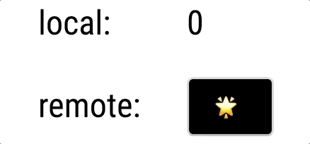

<!-- sectionTitle: A Minimal Example -->

<!-- note
reduxを使ったことがある人は、reduxだったらどう書くかを想像して聞いてもらえると比較しやすいかもしれません。
-->

## アプリケーションを作ってみる

---


<br />

* 1: ページが読み込まれたらリポジトリの ID を取得する
  * `query`で GitHub の Repository を 実行
* 2: ボタンを押すと以下の動作を行う
  * ID を使い、`mutation`で GitHub の AddStar を 実行
  * ローカルデータのカウントを上げる

---

## 必要なこと

* Apollo Client を作成する
* Initial State を作成する
* Resolvers を作成する
* コンポーネントを作成する

---

## Apollo Client

<!-- prettier-ignore -->
```javascript
import { ApolloClient, InMemoryCache, ApolloLink, HttpLink } from 'apollo-boost';
import { withClientState } from 'apollo-link-state';
import { initialState } from './state';
import { resolvers } from './resolvers';

const cache = new InMemoryCache(); // store
const stateLink = withClientState({ // local
  cache,
  defaults: initialState,
  resolvers
});
const httpLink = new HttpLink({ // http
  uri: 'https://api.github.com/graphql',
  headers: {
    authorization: `Bearer ${process.env.TOKEN}`
  }
});
const link = ApolloLink.from([stateLink, httpLink]);

export const client = new ApolloClient({
  link,
  cache
});
```

---

## Initial State

```javascript
// ローカルのステートを定義する

export const counter = {
  current: 0,
  __typename: 'Counter'
};

export const initialState = {
  counter
};
```

---

## Repository Id を取得する


```javascript
export const GET_REPO = gql`
  query {
    repository(owner: "hiroppy", name: "apollo-link-state-sample-for-slide") {
      id
    }
  }
`;

export class GetRepoQuery extends Query<{ repository: { id: string } }> {}

export const Id: React.FC = () => (
  <GetRepoQuery query={GET_REPO}>
    {({ loading, error, data }) => {
      if (loading) return '✍️ Loading...';
      if (error) return `Error! ${error.message}`;

      return data && <span>{data.repository.id}</span>;
    }}
  </GetRepoQuery>
);
```

---

## スターを付け、カウンターを更新する

<br />



---

<!-- prettier-ignore -->
```javascript
export const ADD_STAR = gql`
  mutation AddStar($id: ID!) {
    addStar(input: { starrableId: $id }) { # GitHubのAPIを叩く
      clientMutationId
    }
    updateCounter @client # ローカルで定義したリゾルバへ処理に移行する
  }
`;

export const Button: React.FC = () => (
  // すでに1で同じリクエストの問い合わせを行っているため、同じリクエストは行われない
  <GetRepoQuery query={GET_REPO}> {/* repositoryの結果が帰ってきたらここも変更される */}
    {({ loading, error, data }) =>
      data && data.repository ? ( {/* repositoryの情報が取得されたらボタンを出す */}
        <AddStarMutation mutation={ADD_STAR} variables={{ id: data.repository.id }}> {/* $id を設置 */}
          {(addStar, { loading, error }) => {
            if (error) return `Error! ${error.message}`;
            return (
              <button onClick={() => addStar()} disabled={loading /* 送信中のときはdisabled */}>
                {loading ? '💌' : '🌟' /* 送信中はアイコンを変更 */}
              </button>
            );
          }}
        </AddStarMutation>
      ) : null
    }
  </GetRepoQuery>
);
```

---

## ローカルのカウンターを更新するリゾルバ

```javascript
export const GET_COUNTER = gql`
  query {
    counter @client {
      current
    }
  }
`;

export const resolvers: IResolvers = {
  Mutation: {
    // AddStar で実行されたupdateCounterの処理
    updateCounter: (_, variables, { cache }) => {
      const query = GET_COUNTER;
      const prev = cache.readQuery({ query }); // currentデータを取得
      const data = { current: prev.counter.current++ };

      cache.writeData({ query, data }); // 更新

      return null;
    }
  }
};
```

---

## カウンター

<!-- prettier-ignore -->
```javascript
export const GET_COUNTER = gql`
  query {
    counter @client { # ローカルフラグ
      current
    }
  }
`;

export const Counter: React.FC = () => (
  /* ADD_STAR で実行された updateCounter内でstoreが更新され、反映される */
  <GetCounterQuery query={GET_COUNTER}>
    {({ loading, error, data }) => {
      if (loading) return 'Loading...';
      if (error) return `Error! ${error.message}`;

      return data && <span>{data.counter.current}</span>;
    }}
  </GetCounterQuery>
);
```

---


```javascript
import { Id } from './Id';
import { Button } from './Button';
import { Counter } from './Counter';

export const Top: React.FC = () => (
  <>
    <Id />
    <Counter />
    <Button />
  </>
);
```
