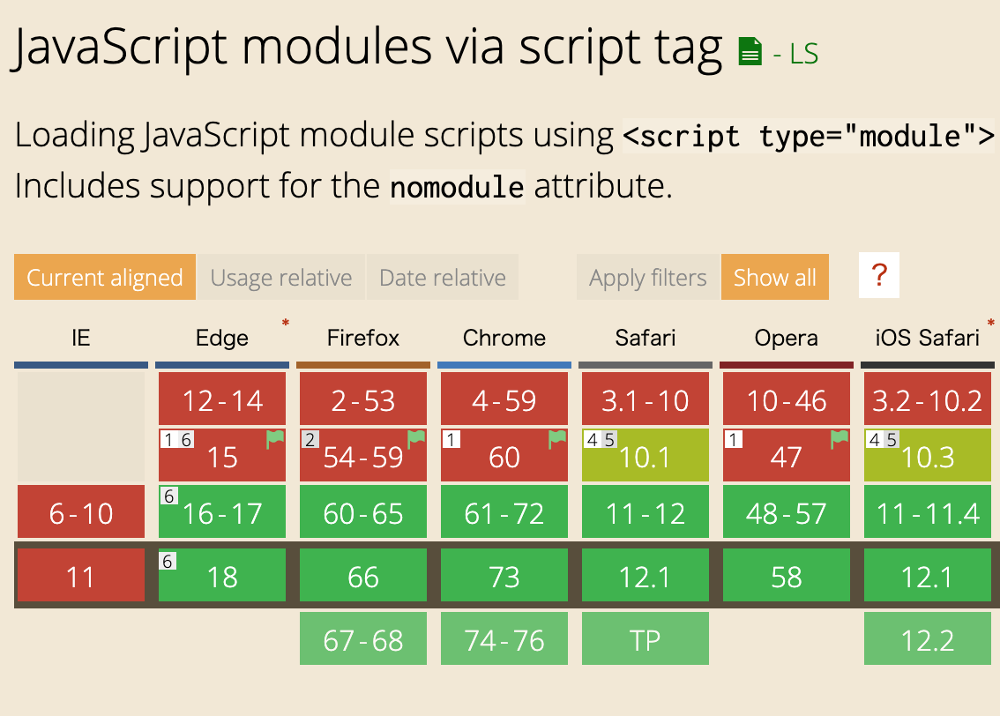

<!-- sectionTitle: Modules -->

<!-- note
JavaScript has many module systems. For example, AMD, UMD, and CJS.
This specification is owned by WHATWG and TC39.
TC39 has ESM syntax / and rules concerning javascript.

For example, the default is strict mode / and how to treat "this", etc...
However, modules loading is owned by WHATWG / because it is the difference between browsers and Node.js.

On the other hand, dynamic import is javascript only syntax, so TC39 manages it. Now, dynamic import is stage-3 of TC39
-->

## ECMAScript Modules

<br />

[whatwg/loader](https://whatwg.github.io/loader/)  
[ECMAScript Language: Scripts and Modules](https://tc39.github.io/ecma262/#sec-ecmascript-language-scripts-and-modules)

---

<!-- note
You can specify "module" to "type" attribute in "script" / to make it recognized as ESM. However, browsers that don't know `type: module` / ignore this script tag.
In other words, it is not executed.

So you use the `nomodule` attribute. Browsers that don't support ESM / can ignore this attribute / and execute it / as a normal script tag / because `type` attribute has not changed.
And browsers that support ESM / don't execute this script. I think / files into one using a bundler / usually have this attribute.
-->

## HTML

```html
<!-- browsers that support ESM -->
<script type="module" src="esm.js"></script>
<script nomodule src="fallback.js"></script>

<!-- interpreting browsers that don't support ESM are to the below -->
<!-- <script type="module" src="esm.js"></script> --> <!-- ignore this line -->
<script src="fallback.js"></script> <!-- ignore `nomodule` attribute -->
```

<a href="https://developers.google.com/web/fundamentals/primers/modules" class="ref-link">Using JavaScript modules on the web</a>

---

<!-- note
All browsers can use modules / other than Internet Explorer.
We might not need bundlers / like webpack / in the future.
However, it is still more efficient / to bundle large code now.
-->

## Browser Compatibility



<a class="ref-link" href="https://caniuse.com/#search=modules">can I use modules</a>

---

<!-- note
I think / many people are already using ESM.
ESM has `import` and `export` syntax. Like this example.

I describe the features of ESM.

`import` and `export` / can only be written at the top level.
this makes it possible / to detect errors before execution.
If you want to get modules as asynchronously, please use dynamic import / which is stage-3 of tc39.
And, since `import` statement is hoisting, it is declared / at the beginning of the module / wherever it is written. So / this is the same behavior / as a function declaration.
Also, the top level `this` in the module / becomes undefined / and a module / which is written in ESM / becomes strict mode.
-->

## ECMAScript Modules

```javascript
import defaultExport from 'module-name';
import * as name from 'module-name1';
import { name } from 'module-name2';
import { export as alias } from 'module-name';
import 'module-name';

export { name as name2 };
export let name1 = '1', name2 = '2';
export function FunctionName() {}
export class ClassName {}

(async () => {
  const { default: foo } = await import('module-name3');
})();

// ref:
//   https://developer.mozilla.org/en-US/docs/Web/JavaScript/Reference/Statements/import
//   https://developer.mozilla.org/en-US/docs/Web/JavaScript/Reference/Statements/export
```
