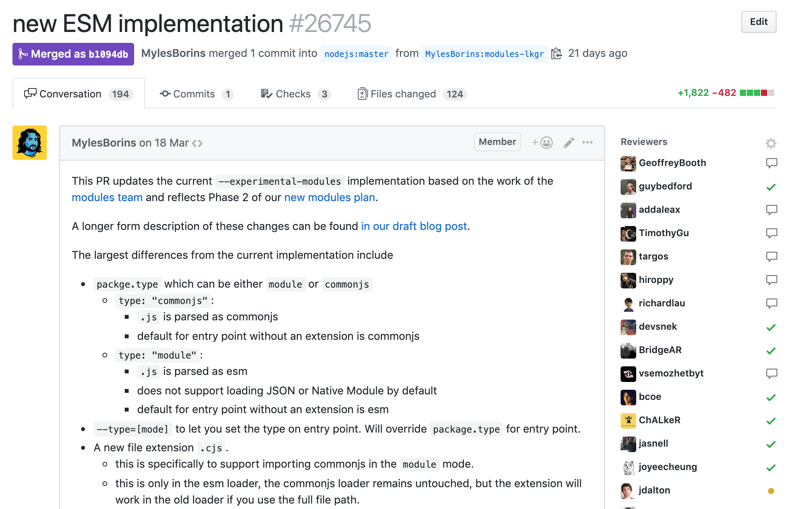
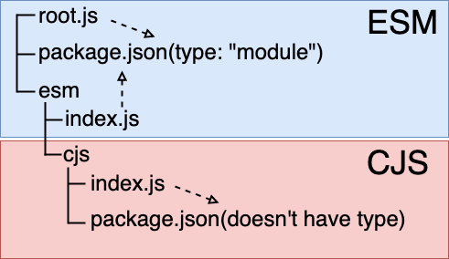

<!-- sectionTitle: ESM in Node.js -->

<!-- note
Let's look at Node.js ESM.
Currently, the status of ESM is stability:1.
Node.js has stability level. It has 3 phases, 0 is Deprecated, 1 is Experimental, and 2 is Stable.
Since stability 1 is experimental, it will be changed sometimes. Therefore, you should not use it in production.
-->

## ESM in Node.js

<br />

Stability: 1  
👷‍ the specifications may change in the future

<br />

The goal is to “release” (drop a flag) by when Node 12 starts LTS in October 2019.

<br />

[Plan for New Modules Implementation](https://github.com/nodejs/modules/blob/master/doc/plan-for-new-modules-implementation.md#plan-for-new-modules-implementation)

---

<!-- note
PR was submitted on 18th March / to Node.js Core by Myles.
We discuss the specification at nodejs/modules. Then, implement at nodejs/ecmascript-modules / which forked Node.js Core, and finally / backport to Node.js Core.
-->



<a href="https://github.com/nodejs/node/pull/26745" class="ref-link">https://github.com/nodejs/node/pull/26745</a>

---

<!-- note
Node.js spent a long time implementing ESM.
Node.js had two major problems / that browsers don't have.

One is that Node.js cannot recognize / if a file is written in ESM.
In the case of browsers, it can be recognized / because it is written as `module` / in the `type` attribute.
However, Node.js' import doesn't have an attribute / like the `type`.
So we decided to look at the file extensions / to be imported.
We made a rule / that a file with the `.mjs` extension is written in ESM.

And another issue is compatibility with existing CJS Modules.
Node.js values backward compatibility. However, Node.js already has a module system.
It's very difficult / to implement ESM / so as not to break the existing code.

-->

## Node.js specific issues

<br />

Node.js spent a long long time to implement ESM...

<br />

- whether the file to be called is written in ESM or not
- compatible with CJS

---

<!-- note
Node.js defined the standard / for implementation.

* Spec compliance
  * we always follow the ECMAScript spec
* Browser equivalence
  * a code that executes in both environments / should produce identical results
* Don’t break CommonJS
  * we cannot cause breaking changes / with regards to CommonJS

We keep these standards / and implement ESM in Node.js.
--->

## Standards

<br />

- Spec compliance
  - always follow the ES spec
- Browser equivalence
  - a code that executes in both environments should produce identical results
- Don’t break CommonJS
  - cannot cause breaking changes with regards to CommonJS

<br />

[Node.js Foundation Modules Team](https://github.com/nodejs/modules)

---

<!-- sectionTitle: Rules -->

<!-- note
I would like to introduce some of ESM rules.
-->

## Rules

---

<!-- note
ESM's path conforms to whatwg url.
See the example.
As you can see, import syntax accepts URL object.
Access using a relative path, an absolute path, a package name, and `file` protocol can be performed.
Currently, protocols support only `file`.
-->

## ESM's path conforms to whatwg url

```javascript
import './foo.js';
import 'file:///xxxx/foo.js';

// dynamic import
(async () => {
  const baseURL = new URL('file://');
  baseURL.pathname = `${process.cwd()}/foo.js`;

  const foo = await import(baseURL);

  console.log(foo); // [Module] { default: 'hello' }
})();
```

---

<!-- note
You can not use Node.js specific variables / that were available until now.
Such as, `require`, `module`, `exports`, `__dirname`, and `__filename`.
These variables will become `undefined` / when you write in ESM.

To use these variables in ESM, you can use `import.meta` or `createRequireFromPath` to reproduce the same behavior.
If you want to get a file path, you can use `import.meta.url`.
This is an ESM specification / and currently exists in stage-3 of TC39.
If you want to use `require` syntax in ESM, you can use `createRequireFromPath` method. By passing a based path as an argument, This function returns an executable `require` method / based on passed the argument.
-->

## Invalid variables

```javascript
// The following variables don't exist in ESM.
console.log(typeof require);
console.log(typeof module);
console.log(typeof exports);
console.log(typeof __dirname);
console.log(typeof __filename);

// Substitutes ------------------------------------
// Get a path info like __dirname and __filename.
console.log(import.meta);
// [Object: null prototype] {
//   url: 'file:///Users/xxxx/index.js'
// }

// Create `require` function.
import { createRequireFromPath } from 'module';
import { fileURLToPath } from 'url';

// ./
const require = createRequireFromPath(fileURLToPath(import.meta.url));

// ./cjs/index.js
require('./cjs/index.js');
```

---

<!-- note
CJS can omit `.js`, `.node`, `.json` extensions / and the filename "index".
However, ESM doesn't have this specification, so we also make this CJS specification / unavailable in ESM by default.
So, we prepared `--es-module-specifier-resolution` flag.
This flag has `explicit` and `node` options, and the default is `explicit`.
I think / most of the existing code written in ESM / has omitted the extension and `index`. Then, please use `node` option.
-->

## Explicit filenames

`explicit` and `node` exist, the default is `explicit`  
since explicit file extensions are usually required on the Web.

<br />

- file extensions are mandatory in import statements
- cannot omit index.js

<br />

```javascript
// strict/index.js

import './foo/index.js'; // --es-module-specifier-resolution=explicit
import './foo'; // --es-module-specifier-resolution=node
```

```sh
$ node --experimental-modules --es-module-specifier-resolution=node ./strict/index.js
$ node --experimental-modules  ./strict/index.js # default is `explicit`
```

---

<!-- note
In the future, you will not be able to execute anything / other than JavaScript.

CJS supported JSON(`.json`) and native modules(`.node`), but ESM does not.
You might use `module.createRequireFromPath()` for these.

However, Node.js has `--experimental-json-modules` flag to load JSON
/ because there is work in progress / for standardizing this feature / with browsers.
-->

## JavaScript only

<br />

CJS supported JSON(`.json`) and native modules(`.node`), but ESM does not.  
You might use `module.createRequireFromPath()` for these.

<br />

However, Node.js has `--experimental-json-modules` flag to load JSON  
because there is work in progress for standardizing this feature with browsers.

<br />

[whatwg/html "JSON modules"](https://github.com/whatwg/html/issues/4315)

---

<!-- note
This example is written in CJS.

It is impossible / to call an ESM file / using require syntax.
On the other hand, if you use import syntax, you can call CJS files.
However, only dynamic import can call ESM files / from CJS.

In conclusion, CJS cannot call ESM / at the top level, but CJS can use dynamic import. Also, ESM can call CJS.
-->

## Cannot load ESM from CJS

```javascript
// // Reading ESM at top-level is prohibited.
// import foo from './esm/foo.js'; // invalid

// // An error occurs because the read file is written as ESM.
// // `require` expects read file as CJS
// require('./esm/foo');
//
// // export default typeof module !== 'undefined' ? 'cjs' : 'esm';
// // ^^^^^^
// // SyntaxError: Unexpected token export

console.log('root.js:', typeof module !== 'undefined' ? 'cjs' : 'esm'); // cjs

(async () => {
  const { default: foo } = await import('./esm/foo.js');
  console.log('foo.js :', foo); // esm
})();

// Conclusion
// 🙆‍♀️ ESM -> CJS
// 🙅‍♀️ CJS -> ESM (excluding dynamic import)
```

---

<!-- sectionTitle: How to resolver ESM and CJS -->

<!-- note
Let's explain how Node.js distinguishes ESM and CJS.
-->

## How to resolve ESM and CJS

---

<!-- note
I think many people have heard the word `.mjs` / in the past.
Certainly, it is easy to distinguish by the extension.
However, in the future, ESM will become the de-facto standard,
so we don't want to change the extension / from `.js` to `.mjs` / it's not needed.
Probably, this is something that / many people wanted. So we looked for another solution.
-->

## .mjs ?

<br />

🤔

<br />

It is easy to distinguish a file which has the `.mjs` extension is as ESM.  
But, maybe many people don't want to use the `.mjs` extension.😞

---

<!-- note
There is a way / to specify the module type / to package.json.

This solution is already in the Core of Node.js, and probably will not be changed.
The solution is very simple.
Each file's module type / depends on the closest parent's package.json.

See this picture.
package.json on the root.js has `type: module`, so root.js will be read as ESM.

index.js in esm directory doesn't have package.json / in the same hierarchy / so index.js depends on package.json in the root hierarchy.
Therefore, this file is also read as ESM.

Finally, let's look at the index.js in cjs. package.json exists in the same hierarchy / but doesn't have `type` attribute. So, index.js is read as CJS.
-->

## Package.json "type" field

<br />



<br />
Refers to the closest parent's package.json.

<br />

👷‍ `type` name might change. [issue](https://github.com/nodejs/modules/issues/312)

---

<!-- note
You can specify the type attribute / in package.json.
This attribute has `commonjs` and `module`, and the default is `commonjs`.
-->

## package.json

<br />

```json
{
  "type": "module" // or `commonjs`, the default is `commonjs`
}
```

<br />

Basically, all node_modules don't have `type` field,  
so they are read as CJS. Thus this change isn't breaking changes.

---

<!-- note
Let's check the code. The directory structure is the same as the previous slide.

Since / ESM doesn't have a `module` variable, it is ESM if `module` is undefined.

Look at the output results.

At first, `./esm/index.js` is called / and output as ESM. This file depends on package.json / of the root directory.
Next, `./esm/cjs/index.js` is called / and output as CJS. This file depends on package.json / which exists in the same hierarchy / and this package.json doesn't have `type` attribute.
Finally, `./root.js` outputs as ESM / because package.json in the same hierarchy has `type:module`.
If package.json in the root directory / doesn't have `type:module`, this file can not be executed. Because it is executed as CJS, it can not interpret import syntax.
-->

<!-- prettier-ignore -->
```javascript
/**
├── esm
│   ├── cjs
│   │   ├── index.js
│   │   └── package.json (commonjs is used because type is not specified)
│   └── index.js
├── package.json (type: module)
└── root.js
 */
// ./root.js ----------------------------------------------------------------- 1
import './esm/index.js';
import './esm/cjs/index.js';
console.log('root.js          :', typeof module !== 'undefined' ? 'cjs' : 'esm'); 

// ./esm/index.js ------------------------------------------------------------ 2
// Refers to the closest parent's package.json.
console.log('esm/index.js    :', typeof module !== 'undefined' ? 'cjs' : 'esm');

// ./esm/cjs/index.js -------------------------------------------------------- 3
console.log('esm/cjs/index.js:', typeof module !== 'undefined' ? 'cjs' : 'esm');
```

```shell
$ node --experimental-modules root.js
esm/index.js    : esm # 2
esm/cjs/index.js: cjs # 3
root.js         : esm # 1
```

---

<!-- note
If you do not want to follow this rule / for specific files, you specify the extension.
You can use `.mjs` and `.cjs` extensions.
If you want to read as ESM, use the mjs extension. If you want to read as CJS, use the cjs extension.
-->

## `.mjs` and `.cjs`

All files follow the package.json type rules,  
but there are cases where want to exclude certain files.

By changing the file extension from `.js`,  
it is possible to exclude the application of the rule.

<br />

```javascript
// always read as CJS
import './file.cjs';

// always read as ESM
import './file.mjs';
```

---

<!-- sectionTitle: Working in progress -->

<!-- note
Currently, this is an ongoing task.

* dual CommonJS/ES module packages
* easier `require`
* package path maps
* automatic entry point module type detection

These tasks will be improved / before the `--experimental-modules` flag is removed.
-->

## Working in progress

<br />

- dual CommonJS/ES module packages
  - [Proposal for dual ESM/CommonJS packages](https://github.com/nodejs/modules/issues/273)
- easier `require`
- package path maps
- automatic entry point module type detection

<br />

[Works in progress](https://github.com/nodejs/modules/blob/master/doc/announcement.md#works-in-progress)
