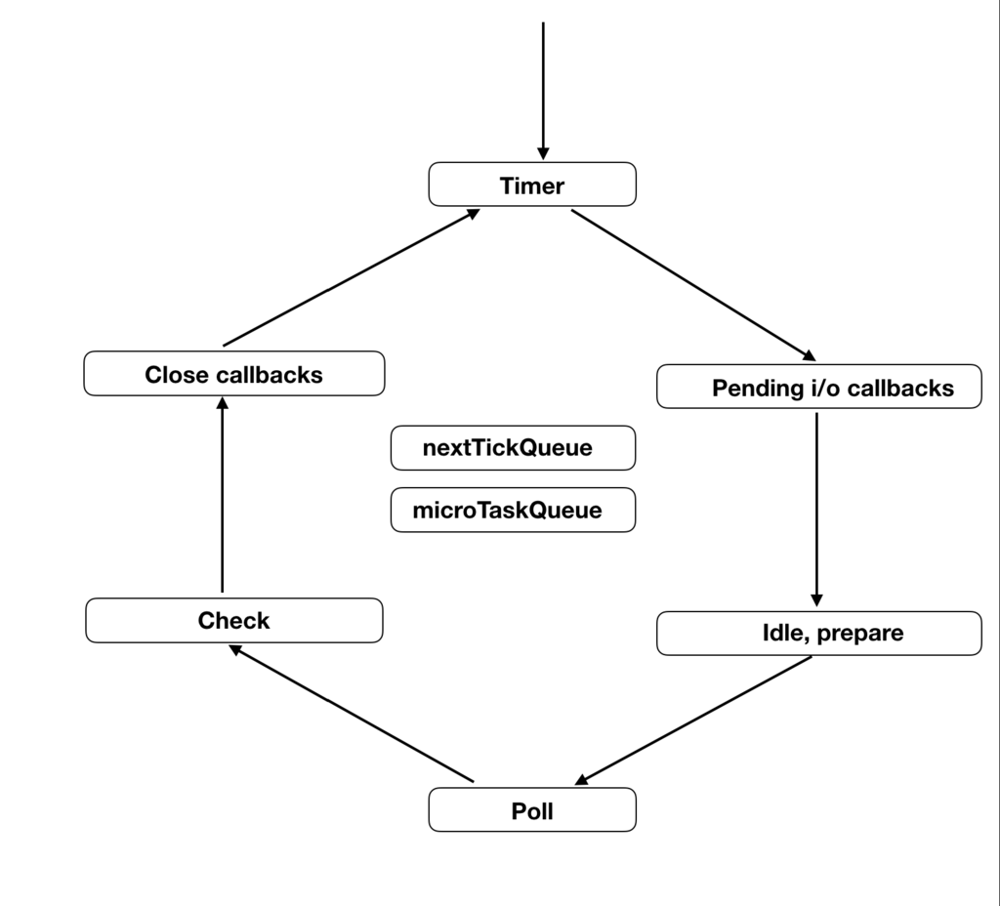
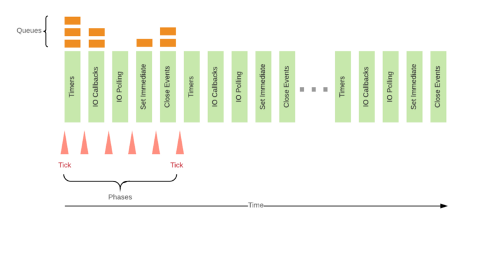

<!-- sectionTitle: Mechanism -->

## Mechanism



<a class="ref-link" href="http://voidcanvas.com/nodejs-event-loop/">http://voidcanvas.com/nodejs-event-loop/</a>

---

## Phases

<br />

The event loop has 6 phases.

- timers
- pending callbacks
- idle, prepare
- poll
- check
- close callbacks

<br />

These phases have a FIFO job queue that has callbacks to execute  
and execution of JavaScript is executed in a phase somewhere excepted "idle, prepare".

---

## Phases

### Timers Phase

This phase is the starting point of the event loop.  
Executes `setTimeout` or `setInterval` timer callbacks.

<br />

### Pending Callbacks Phase

Executes I/O callbacks deferred to the next loop iteration  
that exist in `pending_queue`.

---

## Phases

### Idle, Prepare

It is called internally by libuv.

<br />

### Poll Phase

Waits for the server or I/O response.

<br />

- blocks I/O and calculate polling time
- processing events in the poll queue

---

## Phases

### Check Phase

Executes `setImmediate` timer callbacks.  
If a callback that has a callback registered by `setImmediate` exists  
in the Poll Phase, it is guaranteed to be called before `setTimeout`.

<br />

### Close Callbacks Phase

Executes callbacks that registered by `close` event.

---

## nextTickQueue / microTaskQueue

### nextTickQueue

It has callbacks that registered by `process.nextTick`.  
It is executed the fastest among _asynchronous_ execution.

### microTaskQueue

It has callbacks that registered by `promise`.

<br />

```javascript
/* output order */
/* 1            */ process.nextTick(() => console.log('nextTick'));
/* 4            */ Promise.resolve().then(() => console.log('promise'));
/* 2            */ process.nextTick(() => console.log('nextTick'));
/* 5            */ Promise.resolve().then(() => console.log('promise'));
/* 3            */ process.nextTick(() => console.log('nextTick'));
```

---



nextTickQueue and microTaskQueue execute  
when each phases' queue has empty and finished.

---


