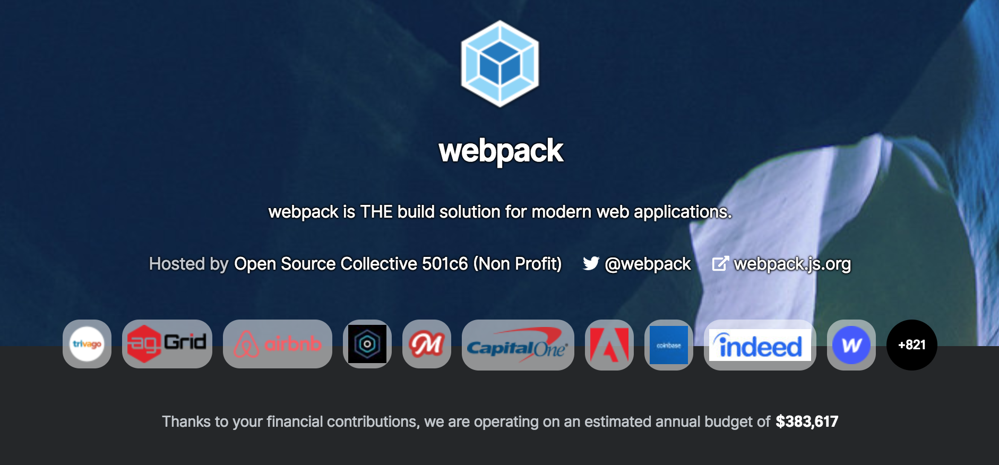
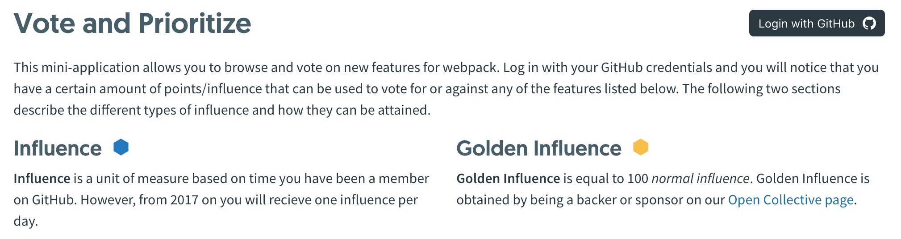

<!-- sectionTitle: Community -->

## Community

---

## Trends

<a class="ref-link" href="https://www.npmtrends.com/webpack-vs-parcel-vs-browserify-vs-rollup-vs-fusebox">webpack-vs-parcel-vs-browserify-vs-rollup-vs-fusebox</a>

---

<!-- note
2つのgithub organazationを持っている。
一つはコアでwebpackやwebpack-dev-server, tapable等がある。
もう一つは、3rd partyパッケージ。例えば、style-loaderやcss-loaderなど。

また、開発メンバーと有名なプラグインの作者が集まるプライベートslackがある。
ここでは、babelなどとのshared channelも存在し、webpackとの関わりがあるOSSとのコミュニケーションを測っている。

-->

## Members & Plugin Authors

 

  

    
     
    
GitHub

    <a href="https://github.com/webpack">webpack</a>, <a href="https://github.com/webpack-contrib">webpack-contrib</a>
  

  

    
     
    
Slack

  

---

<!-- note
backerでは、$2~

trivago, airbnb, facebook opensource, adobe, slackなどで、trivagoが一番多く資金を提供しています。

この資金は、メンバーが開発するときの資金に使われたりします。

-->

## OpenCollective

---

<!-- note
GitHubのメンバーであった時間に基づく測定された単位
2017年からは1日1回の影響がある。

gold influenceは、open collectiveのbackerかスポンサーに与えられます。
これは、influenceの100に等しい値です。

-->

## Vote and Prioritize

 

<a class="ref-link" href="https://webpack.js.org/vote/">webpack.js.org/vote/</a>

---

---

## Short / Long Term Goals

 

  <ul>
    短期目標
    <li>古いものを今後も維持できるように</li>
    <li>スポンサーの獲得</li>
    <li>資金の戦略的利用</li>
    <li>GSOCのサポート</li>
  </ul>
  <ul>
    長期目標
    <li>エコシステムのサポート・保守</li>
    <li>大きいスポンサーへのサポート</li>
    <li>WebAssemblyの改善</li>
    <li>性能・ユーザビリティの向上</li>
    <li>ドキュメント改善</li>
    <li>革新を続け、持続可能なOSSの一例となる</li>
  </ul>

<a class="ref-link" href="https://github.com/webpack/management">webpack/management</a>
