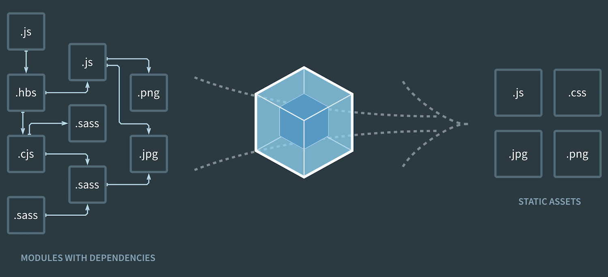

<!-- sectionTitle: Module Bundler -->

<!-- note
06:00 ~
-->

## Module Bundler

---

## Module Bundler

<br />



---

## Modules

```javascript
// ESM (ECMAScript Modules)
import foo from './foo';
export default foo;
import('./foo.wasm'); // native support for WebAssembly
import('./foo.json'); // native support for JSON

// CJS (CommonJS Modules)
const foo = require('./foo');
module.exports = foo;

// AMD (Asynchronous Module Definition)
define(['./foo'], (foo) => foo);
```

```css
@import url('foo.css');
```

```html

```

<a class="ref-link" href="https://webpack.js.org/concepts/modules/">https://webpack.js.org/concepts/modules</a>

---

<!-- note
少し語弊がありそうな図。

webpack_require
* s: `entry`の ID
* c: 各モジュールのキャッシュ `{ [ファイル名]: [module] }`
* m: 各モジュールのリスト `{ [ファイル名]: [内部コード] }`
* p: `__webpack_public_path__`の文字列値
* i = the identity function used for harmony imports
* e = the chunk ensure function
* d: ESM のための getter 関数
* o: Object.prototype.hasOwnProperty.call
* r: `__esModule`を exports へ`Object.defineProperty`でセットする関数
* t: 偽物の名前空間を作成するための関数
* n: ESM ではないモジュールに対する`default`の互換性保持関数
* h: webpack の hash 値
* w = an object containing all installed WebAssembly.Instance export objects keyed by module id
* oe = the uncaught error handler for the webpack runtime
* nc: `nonce`

-->

## How it works at runtime

<br />


---

<!-- note
Production ビルド時では、引数は Object ではなく Array となり、
moduleID がファイル名ではなく、index の値となります。
-->

## Modules Object

```javascript
const modules = {
   // スコープをfunction内に収める
  './a.js': function(module, exports, __webpack_require__) {
    eval(...);
  },
  './b.js': function(module, exports) { // 末端はrequireが存在しないため、第三はない
    eval(...);
  },
  './index.js': function(module, exports, __webpack_require__) {
    eval(...);
  },
  /* !*** multi ./index.js ***! */ // もしentryが配列の場合はこのようになる
  /* ! no static exports found */
  0: function(module, exports, __webpack_require__) {
    eval(...);
  }
};
```

---

## Client-Side CJS and ESM

<!-- prettier-ignore -->
```javascript
// CJS                    // 生成されたコード
const b = require('./b'); // const b = __webpack_require__(/_! ./b _/ \"./b.js\");\n\n
const c = `${b} world`;   // const c = `${b} world`;\n\n

module.exports = c;       // module.exports = c;\n\n
module.exports.d = 1;     // module.exports.d = 1;\n\n
                          // # sourceURL=webpack:///./a.js?
```

<!-- prettier-ignore -->
```javascript
// ESM                       // 生成されたコード
import b1, { b } from './b'; // __webpack_require__.r(__webpack_exports__);\n
                             // /* harmony export (binding) */
                             // __webpack_require__.d(__webpack_exports__, \"d\", function() { return d; });\n
                             // /* harmony import */
                             // var _b__WEBPACK_IMPORTED_MODULE_0__ = __webpack_require__(/*! ./b */ \"./b.js\");\n\n\n

const c = `${b1} world`;     // const c = `${_b__WEBPACK_IMPORTED_MODULE_0__[\"default\"]} world`;\n\n

export default c;            // /* harmony default export */ __webpack_exports__[\"default\"] = (c);\n
export const d = b;          // const d = _b__WEBPACK_IMPORTED_MODULE_0__[\"b\"];\n\n
                             // //# sourceURL=webpack:///./a.js?
```

---

## Processing Dependency Resolution

```javascript
(function (modules) {
  var installedModules = {}; // すでに読み込んだモジュールのキャッシュ

  function __webpack_require__(moduleId) {
    if (installedModules[moduleId]) return installedModules[moduleId].exports;

    var module = (installedModules[moduleId] = { i: moduleId, l: false, exports: {} });

    // module.exportsをbindし、function(module, exports, __webpack_require__) を実行する
    // moduleのexportsにそのファイルからexportsされた実行結果が入る
    modules[moduleId].call(module.exports, module, module.exports, __webpack_require__);
    module.l = true; // 読み込み済みフラグ

    return module.exports;
  }
  return __webpack_require__((__webpack_require__.s = 0)); // entry pointを実行
})({
  0: function (module, exports, __webpack_require__) {
    eval(
      'module.exports = __webpack_require__(/*! ./index.js */"./index.js");\n\n\n//# sourceURL=webpack:///multi_./index.js?'
    );
  },
});
```
