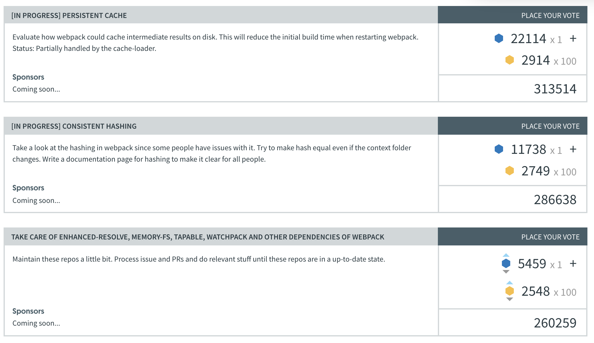

<!-- sectionTitle: Community -->

## Community

---

## Trends

<a class="ref-link" href="https://www.npmtrends.com/webpack-vs-parcel-vs-browserify-vs-rollup-vs-fusebox">webpack-vs-parcel-vs-browserify-vs-rollup-vs-fusebox</a>

---

## Members & Plugin Authors

* github
  * webpack
    * コア
  * webpack-contrib
    * 3rd party パッケージ
* slack

---

<!--note
個人では、$2~

trivago, airbnb, facebook opensource, adobe, slackなど
-->

## OpenCollective

---

<!-- note
GitHubのメンバーであった時間に基づく測定された単位
2017年からは1日1回の影響がある。
-->

## Vote and Prioritize

 

<a class="ref-link" href="https://webpack.js.org/vote/">webpack.js.org/vote/</a>

---

---

<!-- note
時給は$50

この時間は、ツールによって決定される
-->

## Short / Long Term Goals

 

  <ul>
    短期目標
    <li>古いものを今後も維持できるように</li>
    <li>スポンサーの獲得</li>
    <li>資金の戦略的利用</li>
    <li>GSOCのサポート</li>
  </ul>
  <ul>
    長期目標
    <li>エコシステムのサポート・保守</li>
    <li>大きいスポンサーへのサポート</li>
    <li>WebAssemblyの改善</li>
    <li>性能・ユーザビリティの向上</li>
    <li>ドキュメント改善</li>
    <li>革新を続け、持続可能なOSSの一例となる</li>
  </ul>

<a class="ref-link" href="https://github.com/webpack/management">webpack/management</a>
