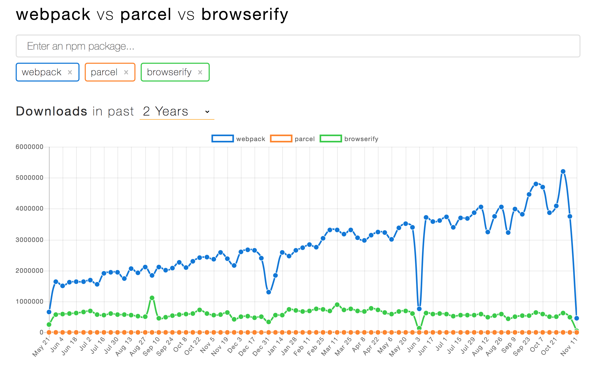

<!-- sectionTitle: Community -->

## Community

---

## Trends

<a class="ref-link" href="https://www.npmtrends.com/webpack-vs-parcel-vs-browserify">webpack-vs-parcel-vs-browserify</a>

---

## メンバー・プラグイン作者

* github
* slack

---

## OpenCollective

---

## Voting

---

## Goals

webpack には、長期と短期の目標が存在します。

https://github.com/webpack/management
