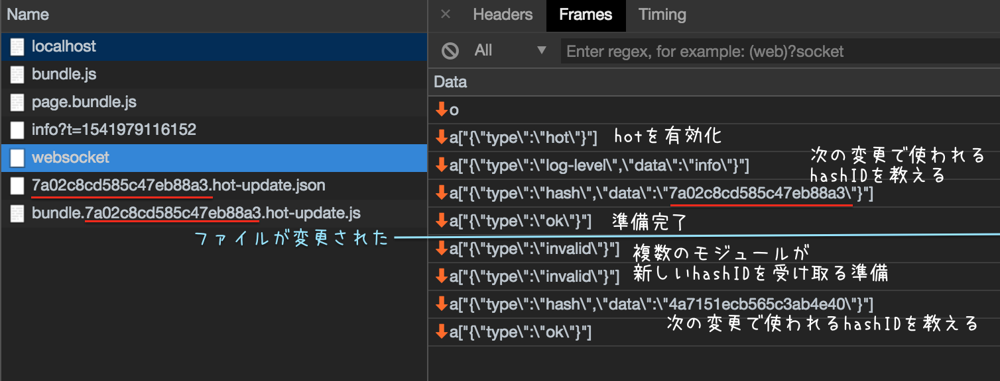

<!-- sectionTitle: Hot Module Replacement -->

## Hot Module Replacement

---

## Hot Module Replacement

<br />

ソースコードが変更されるとブラウザをリロードせずに  
自動的に変更されたモジュールを新しいモジュールへ置換する機能

<br />

* webpack-dev-server
* webpack-hot-middleware
* webpack-hot-client

---

```transparent
                           Browser                                       Node.js

               +-----------------------------+
               |          your code          |
               +-------------+---------------+
                             ^
                     success |                                    monitor file changes
               +-------------+---------------+               +-----------------------------+
           +---+        loader's HMR         |               |                             |
           |   +-------------+---------------+               |           webpack           |
   failure |                 ^                               |                             |
           |                 |                               +--------------+--------------+
reload     |   +-------------+---------------+                              ^
the browser|   |          Runtime            +---+                          |
           |   +-------------+---------------+   | fetch                    |
           |                 ^                   | manifest and             |
           |                 |                   | new module chunk         |
           |   +-------------+---------------+   |                          v
           +--->   webpack/hot/dev-server    |   |           +--------------+--------------+
               +-------------+---------------+   |           |     webpack-dev-server      |
                             ^                   |           +-----------------------------+
                             |                   +---------> | deliver chunks and manifests|
               +-----------------------------+               +-----------------------------+
               |  webpack-dev-server/client  | <-----------> |      websocket server       |
               +-----------------------------+   websocket   +-----------------------------+
                                     send compile result and next hash ID
```

---



---

<!-- prettier-ignore -->
```javascript
// "output.hotUpdateChunkFilename": "[id].[hash].hot-update.js"

webpackHotUpdate("bundle",{
/***/ "./a.js":
/*!**************!*\
  !*** ./a.js ***!
  \**************/
/*! no static exports found */
/***/ (function(module, exports, __webpack_require__) {
  eval(...);
/***/ })
})
```

```json
// "output.hotUpdateMainFilename": "[hash].hot-update.json"

{
  "h": "5946277f0fe1b6e0144e",
  "c": { "bundle": true }
}
```

---

```txt
[HMR] Waiting for update signal from WDS... # webpack/hot/dev-server
[WDS] Hot Module Replacement enabled.       # webpack-dev-server/client
[WDS] App updated. Recompiling...           # webpack-dev-server/client
[WDS] App hot update...                     # webpack-dev-server/client
[HMR] Checking for updates on the server... # webpack/hot/dev-server
[HMR] Updated modules:                      # webpack/hot/dev-server
[HMR]  - ./index.js                         # webpack/hot/dev-server
[HMR] App is up to date.                    # webpack/hot/dev-server
```

wip: webpack/hot and webpack-dev-server
