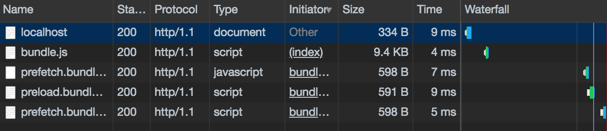

<!-- sectionTitle: Feature: Prefetch / Preload -->

## Prefetch / Preload

<br />

Resource Hints

---

## Prefetch

<br />

`<link rel="prefetch">`

<br />

アイドル状態の時に、将来使用する可能性が高いリソースを取得します。  
ブラウザのページのロードが完了すると  
指定されたドキュメントをプリフェッチしてキャッシュに保存します。

<a class="ref-link" href="https://w3c.github.io/resource-hints/#prefetch">w3c/resource-hints/#prefetch</a>

---

## Preload

<br />

`<link rel="preload">`

<br />

現在のページで利用される読み込み直後に必要なリソース

読み込み後すぐにページに必要なリソース、つまりページ読み込みの過程の初期の、ブラウザの主なレンダリング機構が起動する前に、先読みを始めたいものを指定する宣言的なフェッチ要求を記述することができます。

これにより、ページの最初のレンダリングがブロックされにくくなり、パフォーマンスが向上します。

リソースを事前に発見させ、waterfall 状態の fetch から避けます。

https://medium.com/reloading/preload-prefetch-and-priorities-in-chrome-776165961bbf

---

<!-- prettier-ignore -->
```javascript
import(
  /* webpackChunkName: "prefetch", webpackPrefetch: true */
  './prefetch'
);
import(
  /* webpackChunkName: "preload", webpackPreload: true */
  './preload'
);
```



https://stackoverflow.com/questions/36322349/prefetched-resources-are-loaded-twice
