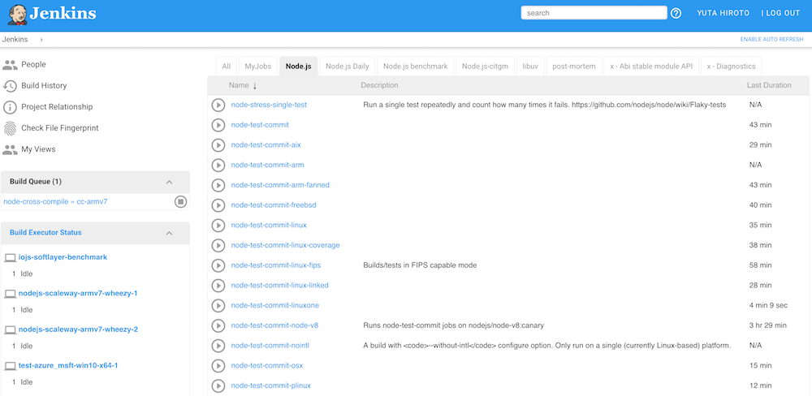

## CI

Node.js is tested on Jenkins provided by Node.js Foundation.  
Basically, will run smoke-test and lint-test for the document PR.

<a href="https://ci.nodejs.org/job/node-test-linter/" class="ref-link">
  https://ci.nodejs.org/job/node-test-linter/
</a>
